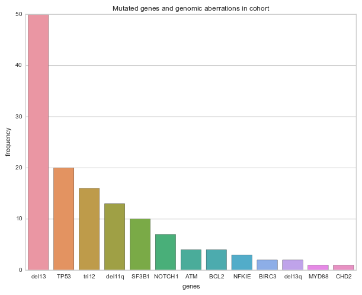

Citing works like this [@Puente2015]

## Abstract
250 words or fewer

## Introduction
## Methods
## Results
##### uCLL vs mCLL

*De novo* motif analysis on differentially open chromatin site between uCLL and mCLL show enrichemnt for the PAX5 transcription factor (TF) [doi:10.1038/ni1454](http://dx.doi.org/doi:10.1038/ni1454).

The Forkhead transcription factor (TF) FOXO1 is also enriched, known to play a role in B cell and highly expressed in CD19+ B-cells, naive and memory and in cases of CLL [10.1182/blood-2011-09-381905](http://dx.doi.org/10.1182/blood-2011-09-381905). Interestingly, this TF seems to be a tumor supressor in classical Hodgkin lymphoma.
Its role in CLL is yet illusive.

Go term enrichment:
"Rho guanyl-nucleotide exchange factor activity" and
"GTPase binding" -> proliferation [doi:10.1038/onc.2013.362](http://dx.doi.org/doi:10.1038/onc.2013.362)

"positive regulation of interleukin-2 biosynthetic process" -> [doi:10.1038/312641a0](http://dx.doi.org/doi:10.1038/312641a0)

## Discussion
## Acknowledgements
## Authorship Contributions
## Disclosure of Conflicts of Interest
## Tables
## Figure Legends
## Figures
{width=75%}

## Supplemental data

## References
